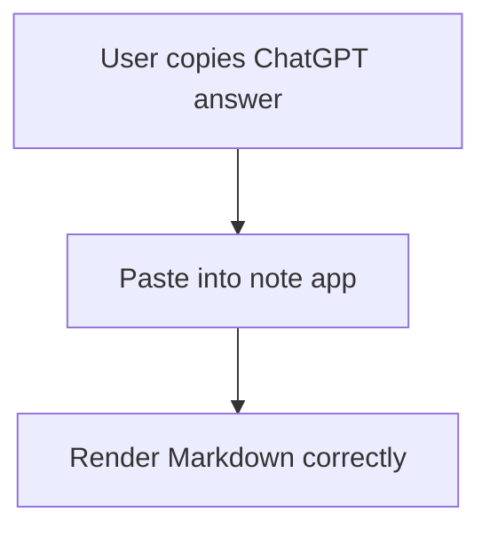

# ChatGPT Markdown Compatibility Test

This is a normal paragraph with **bold**, *italic*, and ***bold italic*** text.

Here is some `inline code` inside a sentence.

## Korean + English Mixed Text

이 문장은 한국어와 English가 섞여 있습니다.  
Markdown 렌더링이 줄바꿈과 강조를 제대로 처리해야 합니다.

## Lists

- First item
- Second item
  - Nested item
  - Another nested item
- Third item

1. Ordered item
2. Ordered item
   1. Nested ordered item
   2. Another nested ordered item

## Task List

- [ ] Write Markdown renderer extension
- [x] Add GFM support
- [ ] Test ChatGPT paste behavior

## Blockquote

> This is a blockquote.
> It has multiple lines.
>
> - It can contain lists
> - It should remain readable

## Table

| Feature | Priority | Status |
|:---|---:|:---:|
| Headings | High | Done |
| Tables | High | Done |
| Math | Medium | Testing |
| Code blocks | High | Done |
| Task lists | High | Done |

## Code Block

```tsx
type Note = {
  id: string;
  title: string;
  content: string;
};

export function renderNote(note: Note) {
  return <article>{note.content}</article>;
}
```

## Bash

```bash
npm install
npm run dev
```

## Math

Inline math: $PV = \frac{CF}{(1+r)^t}$.

Alternative inline math: \(EAC = \frac{PV}{PVIFA(r,n)}\).

Block math:

$$
NPV = \sum_{t=1}^{n} \frac{CF_t}{(1+r)^t} - C_0
$$

Alternative block math:

\[
EAC = \frac{PV}{PVIFA(r,n)}
\]

## Links

[OpenAI](https://openai.com)

https://example.com

[Blocked JavaScript link](javascript:alert(1))

## Image


## Strikethrough

~~This text is removed.~~

## Footnote

This sentence has a footnote.[^1]

[^1]: This is the footnote content.

## Safe HTML

<details>
  <summary>Click to expand</summary>
  This content should be safely rendered if supported.
</details>

<br>

<kbd>Cmd</kbd> + <kbd>K</kbd>

<script>alert("blocked")</script>

## Mermaid Preservation


