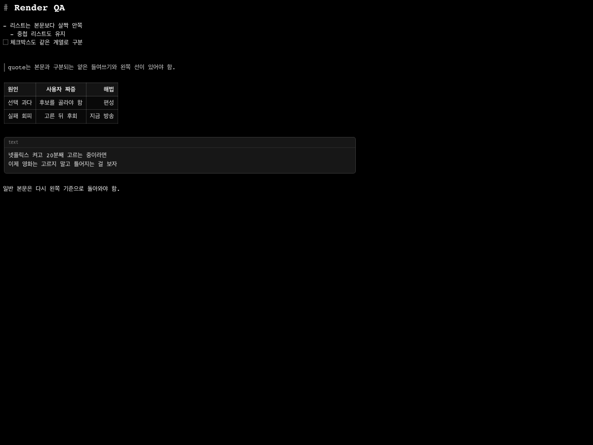

# MemoDolmaeng



스티키 메모처럼 가볍게 띄워두면서도 Markdown을 그대로 쓰고 볼 수 있도록 만든 로컬 macOS 메모 앱입니다.

## 만든 이유

macOS 기본 스티키 메모는 가볍지만 Markdown 문서나 코드 조각을 정리하기에는 부족합니다. 반대로 본격적인 Markdown 에디터는 메모 하나를 잠깐 띄워두고 쓰기에는 무겁습니다.

MemoDolmaeng은 화면 위에 작은 메모를 여러 개 띄워두되, 그 안에서는 Markdown을 자연스럽게 작성하고 보정된 렌더링으로 읽을 수 있게 하려고 만들었습니다.

## 해결 방식

각 메모 창을 독립적인 로컬 윈도우로 만들고, 본문은 raw Markdown을 원본으로 저장합니다. 작성 화면은 `WKWebView` 안의 CodeMirror 기반 에디터로 구성해, 입력 중에는 Markdown 문법을 유지하고 비활성 블록은 읽기 좋게 렌더링되도록 했습니다.

## 구현한 것

- 여러 개의 독립 메모 창
- raw Markdown 기반 저장
- CodeMirror 기반 live Markdown editor
- 제목, 목록, 체크박스, 인용문, 코드블록, 표, 링크, 취소선 렌더링
- ChatGPT 스타일 Markdown/HTML 붙여넣기 보정
- 창 위치, 크기, 색상, 투명도, 항상 위 설정 저장
- 빈 메모 자동 삭제 카운트다운
- 메뉴와 단축키 기반 서식 삽입
- 로컬 앱 관리 저장 구조

## 기술 구성

- Swift Package Manager
- AppKit
- WKWebView
- CodeMirror
- markdown-it / DOMPurify 기반 legacy renderer
- esbuild 기반 에디터 번들 생성

## 실행 방법

```bash
./script/build_and_run.sh
```

에디터 번들까지 함께 검증하려면 다음 명령을 사용합니다.

```bash
./script/build_and_run.sh --verify
```

웹 에디터 단위 테스트:

```bash
npm install
npm run test:editor
```

## 현재 범위

MemoDolmaeng은 클라우드 동기화나 협업 기능보다, 로컬에서 빠르게 띄워두는 Markdown 메모 경험에 집중한 macOS 앱입니다. 스크린샷은 실제 메모 창 캡처 대신 에디터 렌더링 fixture 화면을 사용했습니다. README에서 Markdown 처리 능력을 보여주는 목적입니다.
